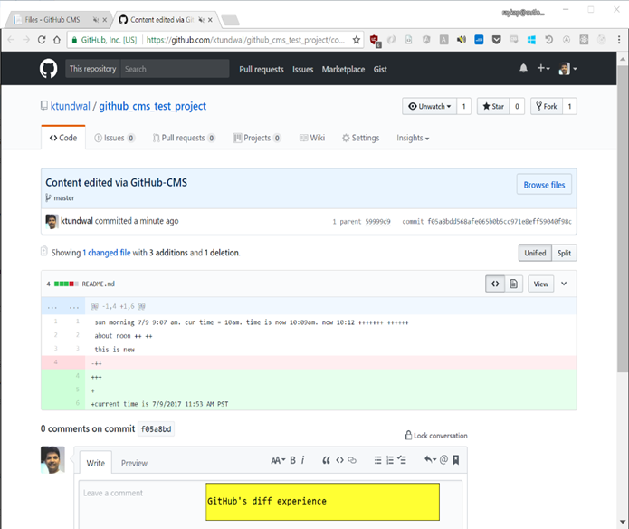

GitHub CMS 0.1 is a proof of concept to demonstrate use of GitHub as a content managment system.

It is a ASP.NET applications that uses GitHub Repository Content API to fetch content for a file, render it in an editor and allow use to save edits.

## Here are key features
### Authentication and authorization
1.	Uses GitHub auth to log user in. 
2.	When user's request comes to the server (in this case it is ASP.NET, could be Node app as well), it determines if user is logged in or not. 
3.	If not, it will redirect user to github.com login page. 
4.	Once logged in, consent form will be presented by GitHub.com to ask user for permissions this POC requires). Conceptually this is like AAD consent form.
5.	Ability to verify if authenticated user is a "contributor" on repository or not. 

### View repo content
User shown Readme.md file from public repo above.

### Commit workflow
1.	Ability to create a commit URL that helps user verify edits by going to GitHub diff page
2.	Error handling: If there is an error while committing, show user the error message
3.	This all code is written using ASP.NET controller framework. 

### What’s not in this POC
1.	Workflow where user have a choice to create a pull request or fork instead of committing directly to master. I haven’t explored API's 
2.	Ability to log user out and/or handling token expiry
3.	Ability to show history of file commits
4.	Ability to persist user/commits info in our own store - this could be beneficial if data persisted on github.com is insufficient for our purposes. An example could be 'owner/writer' per file in a repo. This could assist in "routing pull requests" to writer. ( I am just making this requirement up at this time to make a point)
5.	Content discover-ability: Ability to render find content of interest via TOC, breadcrumbs or search. This POC only allows to edit "Readme.md" file in "github_cms_test_project" repo

## Demo

### Login Experience

### Application consent

### App Home Experience

### Editor Experience

### Post save Experience

### Show changes in GitHub's diff view 

